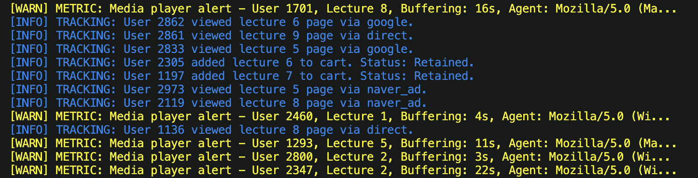
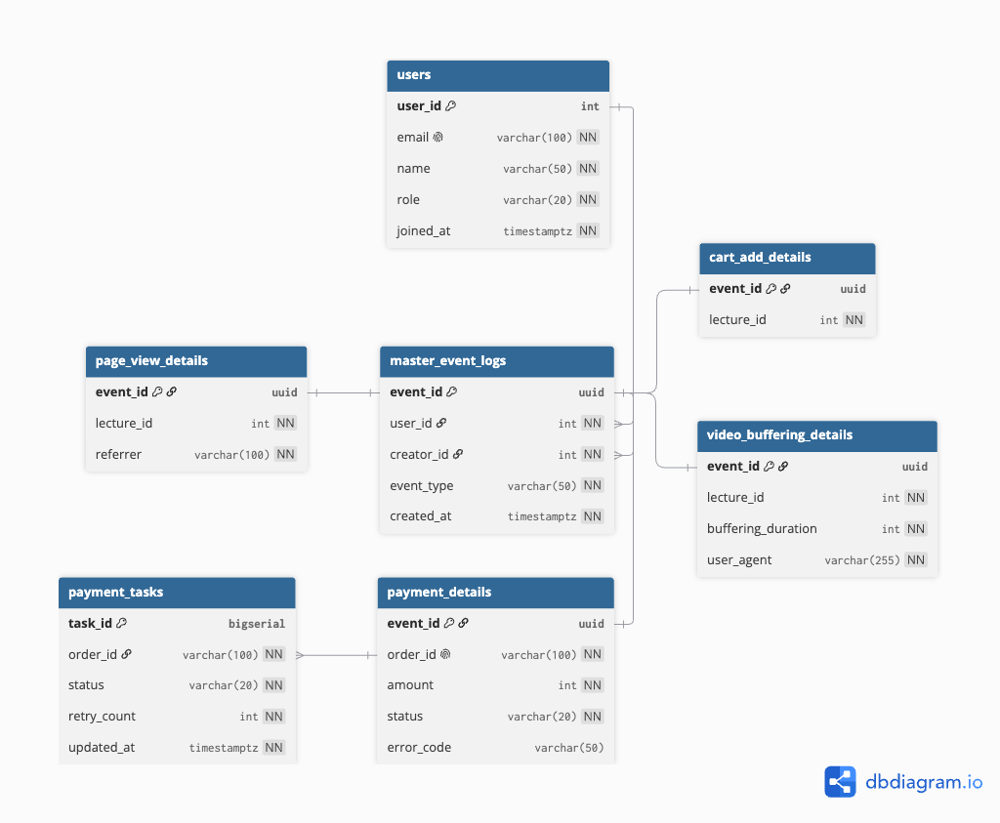

# LiveKlass Event Log Pipeline
본 프로젝트는 단순히 페이지 조회, 구매 등 일반적인 이벤트 로그가 아닌, LiveKlass가 실무에서 직면할 수 있는 시나리오를 기반으로 이벤트 데이터를 실시간 시뮬레이션합니다.

데이터 제네레이터가 생성한 로그는 1차적으로 PostgreSQL에 적재되며, Apache Airflow 통해 대용량 데이터 분석을 염두에 둔 AWS S3로 일 단위 파티셔닝되어 저장됩니다. 최종적으로 이 누적된 데이터 통해 비즈니스 인사이트 및 시스템 위험 요소를 한눈에 파악할 수 있는 대시보드 시각화까지 유기적으로 연결되는 End-to-End 데이터 파이프라인 인프라를 구축했습니다.

## 0. 시나리오란?
본 프로젝트는 의미 없는 가짜 로그를 무작위로 쌓는 것이 아니라, 라이브클래스 플랫폼 운영 중 데이터 팀(데이터 분석가 및 데이터 엔지니어)에게 실제 요구될 법한 구체적인 비즈니스 요구사항과 CS 상황을 가정하여 시작되었습니다.

단순히 데이터를 적재하는 것을 넘어, "이러한 상황이 주어졌을 때 데이터 엔지니어로서 어떤 데이터를 설계하고 수집하여 원인을 추적할 것인가?"라는 전제하에 파이프라인을 구축했습니다. 핵심이 되는 4가지 실무 시나리오는 다음과 같습니다.

**시나리오 1. "장바구니에는 많이 담기는데, 실제 결제로는 잘 안 이어지는 것 같아요."**

- 상황: 기획팀에서 장바구니 추가 후 결제로 넘어가는 전환율이 낮다고 판단하여 분석을 요청했습니다.

- 접근: 특정 강의가 장바구니에 담긴 후 결제 승인까지 이어지지 못하고 이탈하는 비율(Dropout Rate)을 강의별로 수집하여 병목 구간을 찾습니다.

**시나리오 2. "우리 수강생들은 주로 어떤 외부 링크를 통해 들어올까요?"**

- 상황: 마케팅팀에서 광고 매체별 효율을 측정하기 위해 유입 경로 데이터와 서비스 품질의 상관관계를 요구했습니다.

- 접근: 구글, 네이버, 인스타그램 등 유입 Referrer 채널 데이터를 수집하고, 각 채널로 들어온 유저들의 비디오 버퍼링 경험 등을 결합하여 채널별 유저 품질 지표를 분석합니다.

**시나리오 3. "결제는 성공했는데, 이후 오류로 강의 권한 지급이 안 된 케이스는 없나요?"**

- 상황: 운영팀에서 결제 이후 시스템 장애로 인해 서비스 이용을 못 하는 고객이 발생할까 봐 우려하고 있습니다.

- 접근: 결제 완료 후 외부 시스템(알림톡 발송, 수강 권한 지급 등)으로 메시지를 발행할 때 누락되는 현상을 방지하기 위해, 트랜잭션 아웃박스(Outbox) 테이블의 미처리(PENDING) 건수를 실시간으로 모니터링합니다.

**시나리오 4. "특정 강사님 강의만 들으면 버퍼링이 너무 심하다는 CS가 계속 들어옵니다."**

- 상황: 고객지원(CS)팀에 특정 콘텐츠를 시청할 때만 영상 끊김 현상이 발생한다는 문의가 급증했습니다.

- 접근: 전체 버퍼링 로그가 아닌, 크리에이터(강사)별 동영상 버퍼링 지연 시간을 그룹화하여 집계합니다. 이를 통해 특정 콘텐츠 서버나 인프라에 할당된 자원의 병목 여부를 검증하고 위험 랭킹을 산정합니다.

## 1. 프로젝트 개요

이 파이프라인은 다음 흐름으로 동작합니다.

```text
    Event Generator
            ↓
    PostgreSQL
            ↓
        Airflow
            ↓
    AWS S3 Data Lake
            ↓
    Dashboard Image
```

구성 요소는 다음과 같습니다.

| 구성 요소 | 역할 |
|---|---|
| `airflow/dags` | 주기적인 DB 백업과 S3로 백업 데이터 업로드|
| `generator/main.py` | 랜덤 이벤트 생성 및 PostgreSQL 저장 |
| `db/init.sql` | PostgreSQL 테이블 스키마 초기화 |
| `analysis/analytic_queries.sql` | 저장된 로그를 분석하는 SQL 쿼리 |
| `analysis/dashboard.py` | Data Lake에 저장된 CSV 데이터를 읽어 대시보드 이미지 생성 |
| `docker-compose.yml` | 앱, DB, Airflow 실행 환경 구성 |
| `k8s/` | Kubernetes 배포용 매니페스트 |

---

## 2. 실행 방법

### 2.1 필요한 도구

- Docker
- Docker Compose
- Python 3.11 이상
- Kubernetes 테스트 시 `kubectl`

### 2.2 Docker Compose 실행

```bash
docker compose up -d --build
```

실행하면 다음 컨테이너가 함께 실행됩니다.

- PostgreSQL
- Python Event Generator
- Airflow

이벤트 생성기는 자동으로 작동되며, 이후 쿼리 분석과 데이터 시각화를 위해서는 한 번 이상의 Airflow DAG 실행이 요구됩니다.

가능하다면 이벤트 로그가 충분히 적재된 후 UI를 통해 `liveklass_log_management_pipeline` DAG를 실행하거나 아래 명령어로 DAG를 실행해주시길 바랍니다.
```bash
docker compose exec airflow airflow dags trigger liveklass_log_management_pipeline
```
### 2.3 실행 확인

각 컨테이너의 정상 작동을 확인하기 위해서는 다음과 같은 방법을 사용합니다. 정상 작동중이라면 아래 사진과 같이 로그가 생성됨을 확인할 수 있습니다.
#### 2.3.1 Liveklass Generator 실행 확인
```bash
docker logs liveklass_generator -f
```


#### 2.3.2 Airflow 실행 확인
아래 주소를 통해 UI의 접속을 통해 정상 작동을 확인합니다. (Username: admin, password: admin)

[http://localhost:8080/home](http://localhost:8080/home)

#### 2.3.3 postgres DB 실행 확인
아래 명령어를 입력하여 psql shell의 진입을 통해 정상 작동을 확인합니다.
```bash
docker exec -it postgres psql -U admin -d liveklass_db
```

### 2.4 실행 방법 (쿼리 실행 및 시각화)
#### 2.4.1 쿼리 실행
`liveklass_log_management_pipeline` DAG를 한 번 이상 실행했다면, `s3_date_lake`에 여러 `.csv`파일이 생성됨을 확인할 수 있습니다.

이후 제가 말했던 시나리오(말 안하긴 했는데 이 부분 말투 고쳐야함)별 데이터를 확인하기 위한 쿼리들은 `/analysis/analysis_queries.sql`에 시나리오별로 정리되어 있습니다.

혹시 해당 쿼리를 바로 실행할 수 있는 환경이 아니시라면 맨 밑 첨부 페이지를 통해 쿼리 실행 결과를 확인해주시길 바랍니다.(첨부 이미지들 넣자)

#### 2.4.2 시각화 실행
분석한 데이터를 시각화 하기 위해서는 아래 명령어를 실행합니다. 시각화된 결과는 `/s3_data_lake/liveklass_production_dashboard.png` 경로에 생성됩니다.
만약 날짜를 지정하지 않는다면, 모든 데이터를 집계한 시각화 결과가 생성됩니다.
```bash

docker exec -it liveklass_generator python /analysis/dashboard.py 2026-07-01 2026-07-01
#                                                                 |_시작날짜_| |_종료날짜_|
```

---

<!-- ## 3. 이벤트 설계

온라인 강의 플랫폼에서 실제로 분석 가치가 있는 사용자 행동을 기준으로 이벤트를 설계했습니다.

| 이벤트 타입 | 설명 | 설계 이유 |
|---|---|---|
| `page_view` | 강의 상세 페이지 조회 | 마케팅 유입 경로와 관심 강의 분석 |
| `cart_add` | 장바구니 담기 | 결제 전환 및 이탈 분석 |
| `video_buffering` | 영상 버퍼링 발생 | 강의 품질 및 인프라 안정성 분석 |
| `payment` | 결제 시도 | 매출, 결제 실패, 후속 처리 분석 |

이벤트는 단순히 JSON으로 저장하지 않고, 공통 로그 테이블과 이벤트별 상세 테이블로 나누어 저장했습니다.

---

## 4. 저장소 선택 이유

저장소는 PostgreSQL을 선택했습니다.

이유는 다음과 같습니다.

- 이벤트 필드를 테이블 컬럼으로 분리해 저장하기 쉽습니다.
- SQL을 사용해 이벤트 타입별 집계, 결제 상태 분석, 장애 이벤트 분석을 수행할 수 있습니다.
- 공통 이벤트 테이블과 상세 테이블을 분리하여 이벤트 타입이 늘어나도 확장하기 쉽습니다.
- Docker Compose에서 앱과 DB를 함께 실행하기 적합합니다. -->

---
## 5. 스키마 설명

전체 스키마 명세는 `db/init.sql`에 정의되어 있습니다. 

|          테이블          |                    역할 및 특징                          |
|------------------------|-------------------------------------------------------|
| `users`                | 수강생 및 강사의 마스터 계정 정보                             |
| `master_event_logs`    | 이벤트 발생 시간, 유저, 강사, 이벤트 타입 등 공통 데이터 중앙 관리   |
| `*_details` 테이블 (4종) |이벤트 타입별 고유 속성 격리 보관 (예: 버퍼링 지속 시간, 결제 금액 등) |
| `payment_tasks`        | 결제 성공 후 후속 처리를 위한 아웃박스 태스크                    |

---



**핵심 설계 의도**

- **슈퍼타입/서브타입 구조 적용 (1:1 식별 관계)**

    모든 이벤트의 공통 뼈대(누가, 언제, 누구의 강의에서, 어떤 행동을 했는가)는 `master_event_logs에서` 중앙 통제합니다.
    페이지 조회, 장바구니, 버퍼링 등 각 이벤트 고유의 속성은 `event_id`를 PK이자 FK로 공유하는 `_details` 자식 테이블들에 격리 저장했습니다. 이를 통해 `Null` 값의 무분별한 생성을 막고, 새로운 이벤트가 추가되어도 기존 구조를 건드리지 않고 테이블만 추가하면 되는 확장성을 확보했습니다.

- **트랜잭션 아웃박스 패턴 (Transactional Outbox Pattern)**
  
    결제가 완료된 후 권한 지급이나 알림 발송 등 후속 작업이 시스템 장애로 누락되는 현상을 방지하기 위해 `payment_tasks` 테이블을 분리했습니다. 결제 데이터(payment_details)가 생성될 때 동일한 트랜잭션으로 태스크를 PENDING 상태로 기록하여, 시스템 간 메시지 발행을 안전하게 보장하도록 설계했습니다.

공통 필드는 `master_event_logs`에 저장하고, 이벤트별로 다른 필드는 상세 테이블에 저장했습니다.

이렇게 설계하면 공통 이벤트 조회는 단순하게 유지하면서도, 이벤트 타입별 상세 분석을 독립적으로 확장할 수 있습니다.

---

## 8. Docker 구성

`docker-compose.yml`은 다음 서비스를 실행합니다.

| 서비스 | 역할 |
|---|---|
| `postgres-db` | 이벤트 로그 저장용 PostgreSQL |
| `python-generator` | 랜덤 이벤트 생성 및 DB 저장 |
| `airflow` | 로그 백업 및 배치 작업 실행 환경 |

Docker Compose 실행 후 이벤트 생성부터 저장까지 자동으로 동작하도록 구성했습니다.

---

## 9. Kubernetes 선택 과제 A

Kubernetes 매니페스트는 `k8s/` 디렉토리에 작성했습니다.

| 파일 | Kubernetes 리소스 | 역할 |
|---|---|---|
| `k8s/secret.yml` | Secret | DB 접속 정보 및 초기 SQL 관리 |
| `k8s/pvc.yml` | PersistentVolumeClaim(PVC) | PostgreSQL 데이터 저장 공간 요청 |
| `k8s/service.yml` | Service | generator가 DB에 접근할 수 있는 고정 네트워크 이름 제공 |
| `k8s/deployment.yml` | Deployment | PostgreSQL과 generator Pod 실행 관리 |

각 매니패스트별 설계 의도는 다음과 같습니다.

1. `secret.yml`
   
   단순히 비밀번호만 숨긴 것이 아니라, 데이터베이스 초기화 쿼리(init.sql)까지 Secret에 통합하여 리소스 생성을 최소화하였습니다.

2. `pvc.yml`

    Pod는 휘발성의 특징이 있음으로, 데이터를 안전하게 보관하기 위해서 데이터를 DB에 묶어 데이터가 사라지는것을 방지하였습니다.

3. `service.yml`

    Pod의 IP 주소가 계속 바뀌는 쿠버네티스 환경에서, 앱이 언제나 쾌적하게 DB를 찾을 수 있도록 길잡이 역할을 합니다.

4. `deployment.yml`

    이 매니페스트에는 Pod의 리소스 제한, 헬스체크, 컨테이너 간의 실행 순서를 제어하는 의존성 설정이 포함되어있습니다.

    - **컨테이너 실행 순서 보장 (initContainer)**
  
        `python_generator` Pod는 대상이 되는 `postgres DB`가 온전히 쿼리를 받을 준비가 완료되어야만 정상 작동할 수 있습니다. 이로 인한 재시작 에러(`CrashLoopBackOff`)를 방지하기 위해, 제네레이터 Pod 내부에 DB의 헬스체크가 통과될 때까지 실행을 대기시키는 `initContainer`를 선언하여 기동 순서를 엄격하게 동기화했습니다.

    - **초기 자원 할당 (Resource Allocation)**

       Pod가 클러스터 자원을 독점하거나 메모리 부족(OOM)으로 강제 종료되지 않도록, 초기 가이드라인을 참고하여 각 워크로드(DB, 생성기 앱)가 구동되는 데 필요한 최소한의 베이스라인 자원(Requests/Limits)을 할당했습니다.

    - **향후 고도화 계획 (Right-sizing)**

      현재 설정된 자원 할당량은 초기 기준치입니다. 만약 실무처럼 진행한다면 프로메테우스(Prometheus)와 그라파나(Grafana) 같은 모니터링 도구를 클러스터에 연동하여 실제 런타임 사용량 메트릭을 수집하고, 이를 바탕으로 자원을 점진적으로 깎아 나가는 리소스 최적화 작업을 수행할 것입니다.


### 9.1 적용 방법

```bash
kubectl apply -f k8s/secret.yml
kubectl apply -f k8s/pvc.yml
kubectl apply -f k8s/service.yml
kubectl apply -f k8s/deployment.yml
```

### 9.2 상태 확인

```bash
kubectl get deployment,pod,service,pvc,secret
```

## 10. 구현하면서 고민한 점 및 트러블슈팅
프로젝트를 진행하며 가장 깊게 고민했던 부분은 "실무 환경에서 데이터를 어떤 관점으로 바라봐야 실제 비즈니스 문제를 해결할 수 있을까?", 그리고 "이를 구현하기 위해 가장 효율적이고 안정적인 엔지니어링 방식은 무엇일까?"였습니다.

단순히 로그를 파일로만 쌓기보다는, 추후 이벤트 타입이 늘어나고 분석 요구사항이 복잡해질 것을 대비해 아래와 같은 아키텍처 결정을 내렸습니다.

- **저장소 및 스키마 분리**
  
  이벤트를 단순 JSON 텍스트로 밀어 넣지 않고 PostgreSQL을 선택했습니다. 모든 필드를 하나의 큰 테이블에 욱여넣는 대신, 공통 메타 테이블과 이벤트별 상세 테이블을 분리했습니다. 이를 통해 쿼리 조회는 단순하게 유지하면서도 새로운 이벤트 규격이 추가될 때 유연하게 확장할 수 있는 구조를 만들었습니다.

- **실행 의존성 제어**
  
    도커 컴포즈 환경에서는 depends_on과 헬스체크로 컨테이너 실행 순서를 맞췄으나, 쿠버네티스(Kubernetes) 환경에서는 해당 기능이 없기 때문에 제네레이터 Pod에 initContainer를 주입하여 DB가 쿼리를 받을 준비가 완전히 끝난 뒤에만 앱이 구동되도록 제어했습니다.

이러한 뼈대를 구축하고 파이프라인을 연결하는 과정에서 맞닥뜨린 주요 트러블슈팅 사례는 다음과 같습니다.

### 10.1 트러블슈팅 1. Kubernetes 환경에서의 DB 배포 및 스키마 초기화 장애

#### 1. 현상

로컬 도커 컴포즈에서 잘 돌던 제네레이터(liveklass-generator)를 Kubernetes에 배포하자 정상 실행되지 않고 `CrashLoopBackOff` 상태에 빠졌습니다. 로그를 확인해보니 세 단계에 걸쳐 에러가 연쇄적으로 발생했습니다.

1차 에러: `could not translate host name "postgres-service" to address` (DNS 조회 실패)

2차 에러: `FATAL: password authentication failed for user "admin"` (DB 인증 실패)

3차 에러: `relation "users" does not exist` (테이블 없음)

#### 2. 원인 분석
단순한 앱 오류가 아니라 쿠버네티스 배포 구성과 DB 상태(State) 관리의 문제였습니다.

첫째, DB 데이터를 유지할 PVC만 띄워두고, 정작 통신을 담당할 `Deployment와` `Service` 객체를 생성하지 않아 앱이 호스트를 찾지 못했습니다.

둘째, 클러스터에 띄운 DB의 계정 설정값(`POSTGRES_DB` 등)과 제네레이터의 접속 설정값(`.env`)이 불일치했습니다.

셋째, DB 컨테이너는 켜졌지만 내부에 테이블 스키마가 생성되지 않아 앱의 데이터 `Seeding` 로직이 실패했습니다.

#### 3. 해결 조치

DB용 `Deployment와` `Service를` 추가하고, `Service` 이름을 앱이 찾는 `postgres-db`로 일치시켰습니다.

양쪽 컨테이너의 환경 변수(계정, 비밀번호, DB명)가 동일하게 주입되도록 `Secret` 리소스를 재정비했습니다.

로컬에 있던 `init.sql` 파일을 컨테이너 내부로 밀어 넣고(`kubectl cp`), 컨테이너 내부에서 직접 SQL 스크립트를 실행(`kubectl exec`)하여 스키마를 생성했습니다.

마지막으로 제네레이터 `Deployment를` 롤아웃 재시작(`kubectl rollout restart`)하여 정상 접속을 확인했습니다.

#### 4. 교훈

쿠버네티스에서 데이터베이스를 띄울 때는 로컬 .env의 호스트명이 실제 클러스터 내부의 Service 이름과 정확히 일치해야 함을 체감했습니다. 또한, kubectl exec 실행 시 경로는 내 Mac 컴퓨터의 경로가 아니라 격리된 컨테이너 내부의 경로를 가리킨다는 점을 명확히 이해하게 되었습니다.

---


### 10. 2 트러블슈팅 2. Airflow 배치 삭제(Purge) 중 외래키 제약조건 위반 에러

#### 1. 현상

Airflow를 통해 누적된 로그를 S3로 백업한 후, DB 용량 확보를 위해 원본 데이터를 지우는 `purge_database_records` 태스크에서 아래와 같은 에러가 발생하며 배치가 실패했습니다.

```Plaintext
psycopg2.errors.ForeignKeyViolation: update or delete on table "payment_details" violates foreign key constraint "fk_tasks_payment_details" on table "payment_tasks"
```

#### 2. 원인 분석
데이터 정합성을 위해 적용해 둔 트랜잭션 아웃박스 패턴(Outbox Pattern)의 테이블 간 참조 관계(위계질서)가 원인이었습니다.

참조 구조: `master_event_logs` (부모) -> `payment_details` (자식) -> `payment_tasks` (손자)
기존 삭제 쿼리는 이 중간에 낀 `payment_details를` 무턱대고 먼저 지우려 했습니다. RDBMS는 자식 데이터(`payment_tasks`)가 여전히 존재하는 상태에서 부모 데이터를 지우는 행위를 무결성 위반으로 간주하여 트랜잭션을 롤백시켰습니다.

#### 3. 해결 조치
외래키 제약조건을 강제로 끄거나 `ON DELETE CASCADE` 같은 위험한 옵션을 남발하는 대신, 쿼리의 실행 순서를 참조 역순으로 철저히 교정했습니다.
부모를 참조하는 종속성이 가장 강한 최하위 자식 테이블(`payment_tasks`)을 가장 먼저 지우고, 이어서 중간 비즈니스 상세 테이블들(`_details`), 마지막으로 꼬리표가 다 떼어진 최상위 부모 마스터 테이블(`master_event_logs`)을 지우는 순서로 SQL 스크립트를 수정했습니다.

#### 4. 교훈
이 순차 삭제 프로세스 전체를 단일 데이터베이스 세션(트랜잭션)으로 묶어, 도중에 작업이 실패하더라도 일부 데이터만 붕 뜨는 고아 데이터(`Orphaned Data`) 현상을 원천 방지했습니다. 이 과정을 통해 분산 환경을 위한 아웃박스 데이터와 메인 도메인 데이터 간의 위계적 연결성을 실무 레벨에서 명확히 통제할 수 있게 되었습니다.

## 12. 마무리

이 프로젝트는 이벤트 생성, 저장, 분석, 시각화까지 이어지는 작은 데이터 파이프라인을 직접 구성하는 것을 목표로 했습니다.

필수 과제는 Docker Compose 기반으로 실행 가능하게 구성했고, 선택 과제 A로 Kubernetes 배포 매니페스트를 추가했습니다.

일단 이런식으로 해봤는데 아까 너랑 더 상의했던 부분(추후 과제 등)이런거 뭐 **있었더라**